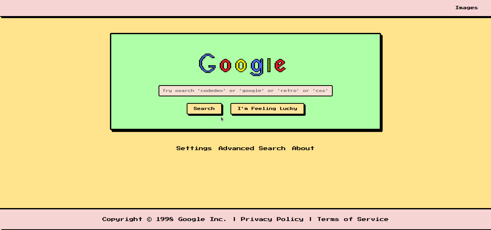

# Retro Google Homepage Redesign

## Overview



This project is a nostalgic redesign of the Google homepage, inspired by the early web of the 90s. Using **HTML**, **CSS**, and **Google Fonts**, it combines retro aesthetics with modern functionality to create a fun and interactive user experience. Featuring pixelated fonts, pastel colors, and playful elements, this project brings the past to life while adding new, exciting features.

## Features

### **Main Features:**
- **Retro Design:** Inspired by 90's web design, using the pixelated "Press Start 2P" font and a soft pastel color palette.
- **Search Feature:** A fully functional search bar with retro-style mock search results that include google, coddex, retro, css .
- **Settings Page:** Customize the  font style, background color, and more.
- **Gmail Feature:** A fun "new" Gmail account with animated gifs to give users the feeling of a Gmail launch.
- **Funny Cat Gifs Page:** A page featuring 20 hilarious cat gifs to brighten your day.
- **Under Maintenance Page:** A playful page displayed during new feature development.
  
### **Interactive Elements:**
- **Search Button:** With hover effects and pixel-like borders.
- **I’m Feeling Lucky Button:** Engaging and interactive with pixel borders and hover effects.
- **Quick Links:** Easy access to pages like Settings, About, and more.

### **Navigation:**
- **Navbar:** Clean, simple top navigation bar with links to Gmail, Images, Settings, and About pages.
- **Footer:** Copyright info, along with Privacy Policy and Terms of Service links.

## Technologies Used

- **HTML:** For page structure and content.
- **CSS:** For styling and creating the retro look.
- **Google Fonts:** For typography, including the "Press Start 2P" font.
  
## How to Run the Project

1. Clone this repository to your local machine:
    ```
    git clone https://github.com/ceeejeey/retro-google-homepage.git
    ```
2. Open the project directory:
    ```
    cd retro-google-homepage
    ```
3. Open `index.html` in your browser to view the homepage.

## Contributions

Feel free to fork this repository and submit pull requests. If you have any ideas for new features or improvements, feel free to open an issue or contribute!

